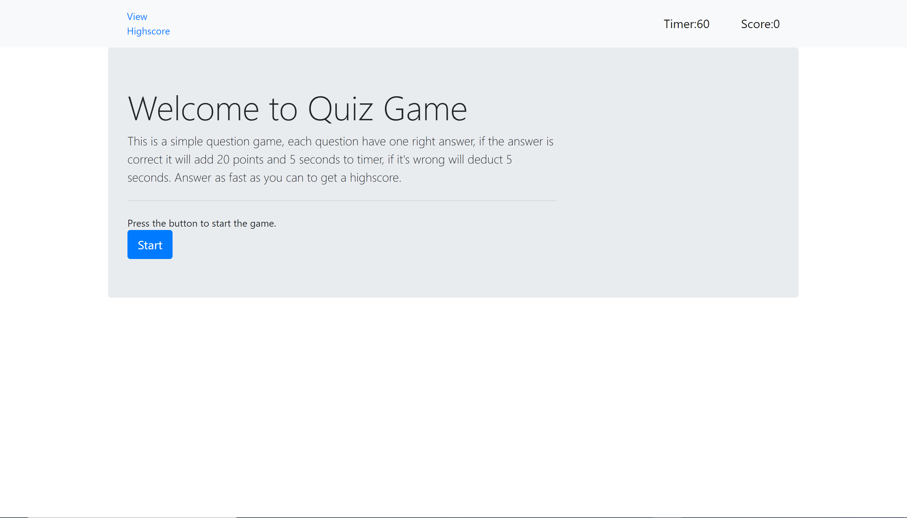

## 04 Web APIs: Code Quiz

### Description of project
The quiz game was developed using bootstrap and javascript, it have a clean, polished, and responsive user interface. The game consist in multiple choice questions with timer and posibility to save the score and display the high score list. High score list will be saved in local storage, you can play later without loosing the score list.

### Screenshot of the project

### Tech/framework used:
* Javascript
* Html(bootstrap)
* CSS not applied

### Instruction for the game
Read the criteria of the game
Click the start button
Timer will start and you will be presented with a question
Answer the questions
When all questions are answered or the time reach 0 seconds, the game is over.
You can save your score, clear high score and you can choose to play again.

### Credits:
* https://www.w3schools.com/js/default.asp
* https://developer.mozilla.org/en-US/docs/Web/API/Window/localStorage
* https://medium.com/better-programming/how-to-use-local-storage-with-javascript-9598834c8b72
* https://medium.com/@meakaakka/a-beginners-guide-to-writing-a-kickass-readme-7ac01da88ab3

### Contributing:
* Name: Ion Gavrilita
* Email: gavrilita.ion.93@gmail.com
* Github profile: https://github.com/IonGavrilita

### Directory:
* Website: 
* Source: 
